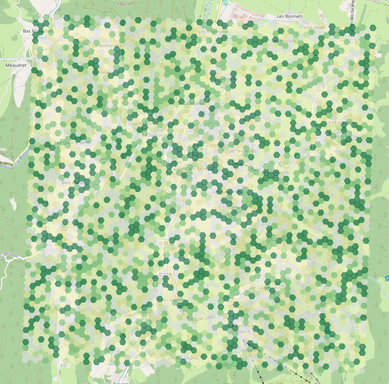
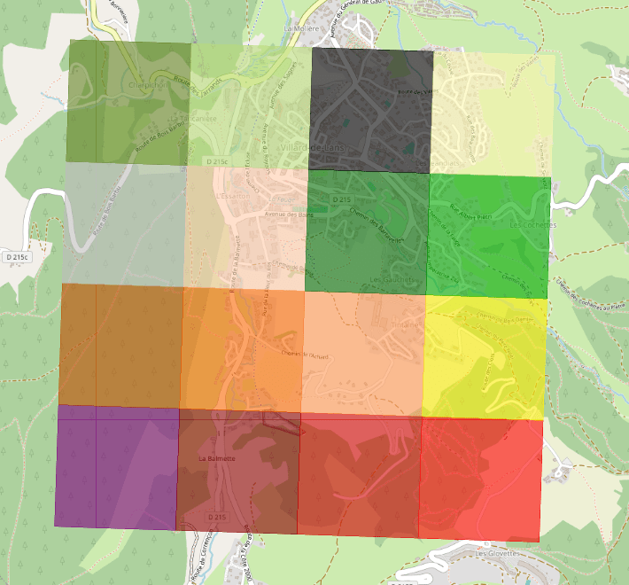

# Données de tests

Générer les données pour toute la Métropole de Lyon prend du temps et de l'espace disque. Par conséquent, nous avons décidé de générer des données de tests qui nous permettent de facilement avoir des données pour tester l'application.

Génération des données :

```bash
python manage.py populate
```

## Ville

Pour ne pas interférer avec les données de la ville de Lyon, les données de tests sont situées à Villard-de-Lans.

Les Iris sont récupérées sur le portail [OpenData du Groupe BPCE](https://bpce.opendatasoft.com/pages/home/).

La géométrie de la ville est fictive, un carré de côté 5km centré sur Villard-de-Lans. La ville est pavée de tuiles hexagonales de 50m de côté.

## Plantabilité

Les scores de plantabilité sont calculées aléatoirement selon une loi uniforme. Le calcul de ces scores est reproductible.



## Zones Climatiques Locales

La ville est quadrillée en 16 morceaux, chacun d'entre eux est affecté à une valeur de LCZ. Cela nous permet de pouvoir tester toutes les valeurs possibles.


