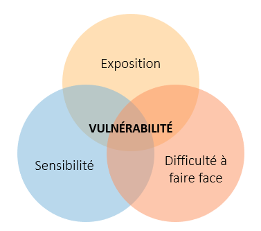

# Atlas de la vulnérabilité à la chaleur

## Origine des données

Les données proviennent du travail de Maurine Di Tomasso (Métropole de Lyon, Service Climat & Résilience –
Direction Environnement, Écologie, Énergie).

C'est une réplication d'[une étude](https://www.institutparisregion.fr/nos-travaux/publications/adapter-lile-de-france-a-la-chaleur-urbaine-acte-2/)
de l'Institut Paris Région, qui décrit en détail la démarche et les hypothèses. Une [storymap](https://geoweb.grandlyon.com/portal/apps/storymaps/collections/7e7862ec92694601a7085074dcaf7481?item=3)
est aussi disponible pour plus de détails.

L'exposition à la surchauffe urbaine est construite à partir d'indicateurs liés à la morphologie d'occupation
des sols. Au-delà de ces paramètres physiques, une analyse croisée des facteurs de risque
et résilience des populations permet d'estimer la sensibilité et la difficulté à faire face.

La vulnérabilité à la
chaleur donc **la somme** de `Exposition + Sensibilité + Difficulté à faire face`.

En pratique, cela se traduit par une note entre 1 (peu vulnérable) et 9 (très vulnérable).

> Cette note se **décline en jour/nuit** car les différents indicateurs vont avoir des effets différents le jour et la nuit. Par exemple le `Facteur vue du ciel`,
> a un effet négatif la journée quand le soleil brille mais positif la nuit quand il permet à la chaleur de s'échapper.

### Sources des données

Les données sont disponibles en open-source sur [DataGrandLyon](https://data.grandlyon.com/portail/fr/jeux-de-donnees/exposition-et-vulnerabilite-aux-fortes-chaleurs-dans-la-metropole-de-lyon/info).
Ces données ne contiennent pas les calculs de sous-indicateurs, seulement de vulnérabilité et d'exposition. Nous avons
eu accès à la version complète de ces données, qui n'est pas publique pour le moment.

## Exposition

En utilisant le logiciel [GeoClimate](https://github.com/orbisgis/geoclimate), les zones climatiques locales (ZCLs) ont
été calculées sur la métropole de Lyon. Puis, à partir de critères observés, des indicateurs d'exposition à la chaleur
sont construits. Les indicateurs permettent ensuite de définir un **score entre -1 et 3**.

| Critère observé   | Indicateurs utilisés par l’Institut Paris Région      | Élément observé                                                                      |
| ----------------- | ----------------------------------------------------- | ------------------------------------------------------------------------------------ |
| **Morphologique** | Densité des volumes bâtis                             | Surfaces proposées à l’interception des rayonnements                                 |
|                   | Facteur de vue du ciel (sky view factor)              | Fraction de ciel hémisphérique visible depuis le sol                                 |
|                   | Rapport hauteur/largeur (aspect ratio)                | Moyenne du rapport hauteur sur largeur des rues canyons                              |
| **Surfacique**    | Pourcentage de végétation haute                       | Ombrage lié aux arbres                                                               |
|                   | Pourcentage de végétation                             | Capacité d’évapotranspiration                                                        |
|                   | Pourcentage de surface en eau                         | Capacité d’évaporation rafraîchissant l’air                                          |
|                   | Pourcentage de surface perméable                      | Potentiel d’évaporation ou d’évapotranspiration d’un îlot                            |
|                   | Proximité de l’îlot à un bois ou une forêt            | Potentiel de fraîcheur par la végétation arborée en provenance des îlots limitrophes |
|                   | Proximité de l’îlot à un cours d’eau ou un plan d’eau | Potentiel de fraîcheur par les masses d’eau en provenance des îlots limitrophes      |
| **Physique**      | Effusivité thermique (surface admittance)             | Capacité de la surface à dégager ou emmagasiner de la chaleur                        |
|                   | Albédo                                                | Réflechissement de la lumière                                                        |

## Sensibilité

A l'intérieur de chaque ZCL, des indicateurs de sensibilité à la chaleur sont calculés, ce qui donne un **score
entre +1 et 3**.

| Critère observé                                          | Indicateur                                                                     | Élément observé                                                                  |
| -------------------------------------------------------- | ------------------------------------------------------------------------------ | -------------------------------------------------------------------------------- |
| **Présence humaine**                                     | Densité d’emploi par m²                                                        | Présence humaine en journée sur le lieu de travail                               |
|                                                          | Densité d’habitants par m²                                                     | Présence humaine la nuit au lieu d’habitation                                    |
| **Présence de populations sensibles via l’âge**          | Effectifs d’enfants de 5 ans et moins et de personnes âgées de 65 ans et plus  | Présence de populations sensibles via l’âge au lieu de résidence                 |
| **Isolement des personnes**                              | Part des ménages composés d’un seul individu                                   | Isolement des personnes                                                          |
| **Inconfort potentiel de l’habitat**                     | Densité d’occupation des logements (nombre d’habitants au m²)                  | Risque de suroccupation et inconfort potentiel de l’habitat                      |
|                                                          | Indicateur approché des logements à faible performance énergétique             | Risques d’entrée de chaleur dans le bâtiment et inconfort potentiel de l’habitat |
| **Dégradation de la qualité de l’air extérieur (ozone)** | Nombre de jours avec une moyenne glissante de 8h supérieure à 120µg/m³ d’ozone | Cofacteur de surmortalité en période de canicule                                 |

## Difficulté à faire face

Toujours pour chaque ZCL, des indicateurs correspondant à la difficulté à faire face sont calculés et donnent un
**score entre +1 et 3**.

| Critère observé                           | Indicateur                                                       | Élément observé                                                                                                                                                                                                                                                                                                                                                                                             |
| ----------------------------------------- | ---------------------------------------------------------------- | ----------------------------------------------------------------------------------------------------------------------------------------------------------------------------------------------------------------------------------------------------------------------------------------------------------------------------------------------------------------------------------------------------------- |
| **Déficit de ressources économiques**     | Part de ménages pauvres                                          | Déficit de ressources économiques de certaines populations pour l’accès aux soins et pour entreprendre des travaux d’entretien ou d’amélioration de leur logement (isolation, ventilation, protections solaires…)                                                                                                                                                                                           |
| **Accès aux soins**                       | Accessibilité à une offre satisfaisante en médecins généralistes | Accès aux soins de jour ; la nuit, ce critère n’est pas considéré du fait de la fermeture des cabinets et dispensaires de médecins généralistes                                                                                                                                                                                                                                                             |
|                                           | Proximité à un service d’urgences hospitalières                  | Accès aux soins de jour comme de nuit                                                                                                                                                                                                                                                                                                                                                                       |
| **Accès à un espace de fraîcheur arboré** | Proximité à un espace vert ouvert au public                      | Proximité à un espace de fraîcheur arboré public dans l’environnement immédiat de son habitat, pour permettre aux populations d’affronter une période de canicule en ayant une forme d’échappatoire de proximité à un appartement surchauffé                                                                                                                                                                |
|                                           | Part de végétation haute                                         | Proximité à un espace de fraîcheur arboré public ou privé (cours arborées, jardins de cœur d’îlot…) dans l’environnement immédiat de son habitat ; l’absence significative d’arbre est considérée comme une difficulté potentielle pour faire face en cas de chaleur car elle prive potentiellement les populations habitant dans un logement surchauffé d’une ressource de fraîcheur à proximité immédiate |
