# Journal des changements

## 🔖 0.19.0 (2025-10-29) : Recherche de lieux améliorée et améliorations pour les tests

### 🛠️ enhance : Changement de l'API de geocoding

On utiliser maintenant [photon](https://github.com/komoot/photon) de Komoot qui est plus robuste que [nominatim](https://nominatim.org/) pour les typos dans la recherche.

&rarr; Commit [1b1ca0a](https://github.com/TelesCoop/iarbre/commit/1b1ca0a7fb839a6c6722dccc2467e4cde0f5f913)

### 🛠️ enhance : Tests fronts et back

- Amélioration du coverage du front et affichage de ce coverage

&rarr; PR [#417](https://github.com/TelesCoop/iarbre/pull/417)

- Accélération des tests back

&rarr; PR [#441](https://github.com/TelesCoop/iarbre/pull/441)

### 🛠️ enhance : Ajout de balises OpenGraph

Ajout de balises OpenGraph sur le site vitrine.
&rarr; PR [#435](https://github.com/TelesCoop/iarbre/pull/435)

## 🔖 0.18.0 (2025-10-22) : Croisement chaleur x plantabilité et site vitrine

### ✨ feat : Affichage d'un nouveau calque vulnérabilité à la chaleur x plantabilité

Ce nouveau calque projet la vulnérabilité a la chaleur sur la maille de la plantabilité pour afficher les 2 en même temps avec une légende bivariée.
Plus de détails se trouvent dans la [documentation](https://docs.iarbre.fr/methodology/plantabilit_vulnerability/).

&rarr; PR [#394](https://github.com/TelesCoop/iarbre/pull/394)
&rarr; PR [#405](https://github.com/TelesCoop/iarbre/pull/405)
&rarr; PR [#407](https://github.com/TelesCoop/iarbre/pull/407)

### 🛠️ enhance : Refacto du site vitrine

L'organisation et le design du site vitrine ont été revu pour mieux présenter et mettre en valeur notre projet sur [iarbre.fr](https://iarbre.fr).
&rarr; PR [#395](https://github.com/TelesCoop/iarbre/pull/395)

### 🛠️ enhance : Corrections de petits bugs et naming

- Ajout d'un changelog de base de données &rarr; PR [#426](https://github.com/TelesCoop/iarbre/pull/426) [#424](https://github.com/TelesCoop/iarbre/pull/424)
- Optimiser la carte et le side pannel &rarr; PR [#416](https://github.com/TelesCoop/iarbre/pull/416)
- Naming et petites incohérences &rarr; PR [#414](https://github.com/TelesCoop/iarbre/pull/414)

## 🔖 0.17.0 (2025-10-01) : Résolution de bugs et message d'accueil

### ✨ feat : Message d'accueil

Lors de la première visite, un message d'accueil s'affiche pour présenter les différentes **fonctionnalités**. Ce message peut être affiché de nouveau en cliquant sur `Afficher les fonctionnalités` dans la barre de navigation.

&rarr; Commit [78e9ae0](https://github.com/TelesCoop/iarbre/commit/78e9ae0bf54b539736be6eced698d46b285a9cbc)

### 🐛 fix: Affichage des ZCL et de la plantabilité

Dans le calque des zones climatiques locales, toutes les rues formaient une seule géométrie, ce qui causait un comportement étrange lors de la sélection. Cela produisait aussi des artefacts dans les vues dézoomées. Il y a maintenant plusieurs sous-géométries pour un comportement plus fluide.
Il y avait, avec le calque de plantabilité, un bug qui faisait qu’au clic, plusieurs tuiles étaient mises en valeur. Ces tuiles partageaient le même ID, ce qui a été corrigé.

&rarr; PR [#363](https://github.com/TelesCoop/iarbre/pull/363)

## 🔖 0.16.0 (2025-09-24) : Contexte plantabilité et score mobile

### ✨ feat : Contexte de plantabilité sur une zone

On peut enfin accéder au score de plantabilité, même en ne zoomant pas complétement. Au passage on affiche aussi la distribution des scores sur la zone.

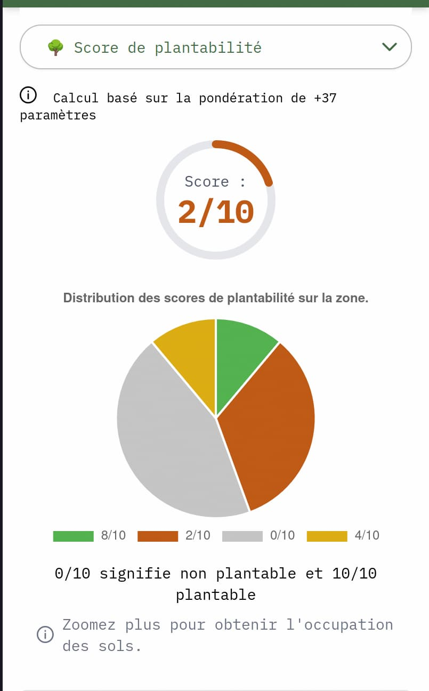

### 🐛 fix: Score sur mobile

Avec les évolutions UI/UX la possiblité d'afficher le score au click sur mobile avait disparu. Cette fonctionnalité est rétablie.

## 🔖 0.15.0 (2025-09-17) : Tests, refactoring Ansible et changements UI/UX

### ✨ feat : Evolutions UI/UX

L'ensemble des affichages et commandes ont été transférées dans un panneau latéral à gauche. Il n'y a plus de popup, quand on clique les données s'affiche de ce panneau. La navigation est plus fluide et facile avec ce regroupement de l'information et des commandes. La taille de la légende a été réduite pour laisser plus de place à l'information sur la carte.
Less informations affichées, en particulier les tableaux et les badges de scores, pour les différents calques sont maintenant homogènes.

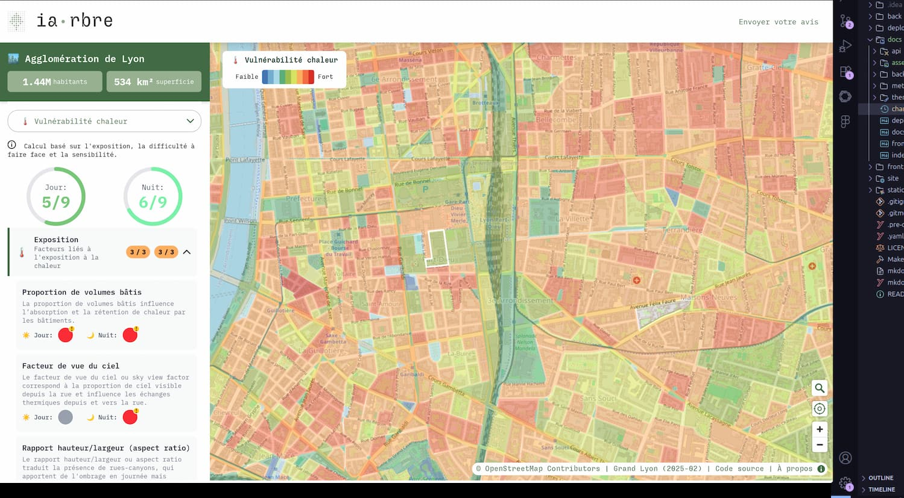

&rarr; PR [#371](https://github.com/TelesCoop/iarbre/pull/371)
&rarr; PR [#366](https://github.com/TelesCoop/iarbre/pull/366)

### ✅ test: Ajouts de tests front et back + calcul de la couverture.

Des tests pour le back et le front ont été ajouté ainsi que des badges sur le `README` qui indiquent les taux de couverture du code.

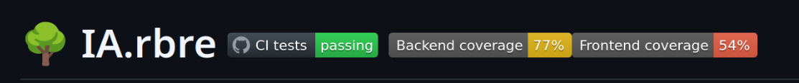

&rarr; Commit [bc66cd3](https://github.com/TelesCoop/iarbre/commit/bc66cd32bbf7d08de2a1312c12c40d5e3ec2a2df)
&rarr; Commit [7c863d4](https://github.com/TelesCoop/iarbre/commit/7c863d4fa11f8848a4fd866cc78ccb02de5214cb)

### 🛠️ enhance : Refacto Ansible

L'ensemble des scripts Ansible ont été ré-organisé et re-découpé pour augementer la clarté et la simplicité. l'objectif est qu'une personne qui arrive sur le projet puisse plus facilement prendre en main ces scripts de deployement.

&rarr; Commit [91d2ed6](https://github.com/TelesCoop/iarbre/commit/91d2ed6cbb9479bd58dd1c83f5887413a017f680)

## 🔖 0.14.0 (2025-07-30) : Evolutions couleurs vulnérabilité chaleur, ajout documentation

### ✨ feat : Ajout de Plausible sur la cartographie

Nous avions Plausible sur [iarbre.fr](https://iarbre.fr) pour suivre le nombre de visites, il est maintenant aussi sur [carte.iarbre.fr](https://carte.iarbre.fr).

### 🛠️ enhance : couleurs du calque de vulnérabilité à la chaleur

Nous avons fait évolué les couleurs afin d'améliorer la sémantique et la lisibilité : des nuances de bleus pour 1 à3, de verts pour 4-6 et de rouge pour 7-9. Des bugs mineurs ont été corrigés.

### 📝 doc: Amélioration de la documentation du backend

Du ménage a été fait dans les fichiers du backend et la documentation a été mis à jour pour permettre une prise en main plus facile.

### 📝 doc: Date de production des données

La date de production des données apparait maintenant sur la carte et dans la documentation.

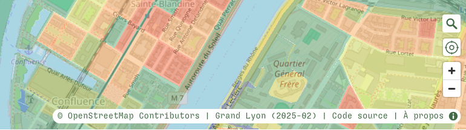

## 🔖 0.13.0 (2025-07-09) : Intégration retours sur la vulnérabilité à la chaleur

### 🛠️ enhance : améliorations visuelles mineurs

Dans le panel de context de vulnérabilité à la chaleur il y avait des imprécisions dans le code couleur et dans les descriptions. Nous avons corrigé ces points en suivant les retours de Maurine Di Tomasso qui a produit la donnée.

## 🔖 0.12.0 (2025-07-02) : Améliorations version mobile et ajout QPV

### ✨ feat : Ajout Quartiers Priotaires de la Ville (QPV)

Il y a un bouton `Afficher les QPV` qui permet d'ajouter les limites des quartiers prioritaires de la ville sur tous les calques.

### 🛠️ enhance : améliorations visuelles mineurs

Le panneau de contexte de vulnérabilité à la chaleur a été amélioré pour les mobiles.

## 🔖 0.11.0 (2025-06-25) : Version mobile et améliorations visuelles

### ✨ feat : Version mobile

Un affichage adapté est maintenant disponible sur mobile. Il permet de naviguer, changer de calque et visualiser les détails.

&rarr; PR [#306](https://github.com/TelesCoop/iarbre/pull/306)

### 🛠️ enhance : améliorations visuelles mineurs

- Le contraste et la lisibilité de l'affichage des scores et légendes a été amélioré. Il est maintenant géré dynamiquement.
- La position du bouton `Diurne`/`Nocturne` pour les vulnérabilité à la chaleur a été déplacé à droite pour une meilleure ergonomie.
- Le panel de context pour la plantabilité n'est accessible que pour les forts zooms, cette information est maintenant affichée dans la popup.
- Nous avons aussi fait quelques petits ajustements sur le site vitrine.

## 🔖 0.10.0 (2025-06-18) : Filtre, cadastre et panel d'explicabilité pour les LCZs

### ✨ feat : Filtrer les zones par score

La légende permet de filtrer l'affichage des calques et de n'afficher que les zones correspondantes aux scores sélectionnés.

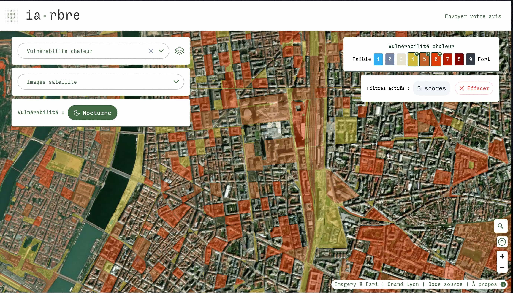

&rarr; Commit [53d9950](https://github.com/TelesCoop/iarbre/commit/53d99507d1004964110b31df97d220a17193ac9f)

### ✨ feat : Panel d'explicabilité pour les zones climatiques locales

La classification des zones climatiques par le CEREMA se base sur un arbre de décision (voir [méthodologie](https://docs.iarbre.fr/methodology/lcz/)) qui prend en compte 8 méta-indicateurs sur le bâti 3D et l'occupation des sols. Les valeurs de ces méta-indicateurs sur un îlot sont maintenant accessibles dans le panel de contexte.

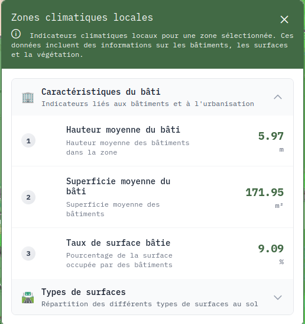

&rarr; Commit [50e7091](https://github.com/TelesCoop/iarbre/commit/50e709188cb52539cf2f60efae8a4e0808da1634)

### ✨ feat : Cadastre en fond de carte

Il y a maintenant une option dans le menu déroulant pour afficher le cadastre avec les numéros de parcelle en superposition de la carte OpenStreetMap en fond de carte.

&rarr; Commit [5e62373](https://github.com/TelesCoop/iarbre/commit/5e62373ac8bdc165597b6e830e48ffe08b533bab)
&rarr; Commit [d83bb41](https://github.com/TelesCoop/iarbre/commit/d83bb41003d7f7bcbeaec96ab0e2f0d45a5b0918)

## 🔖 0.9.0 (2025-06-12) : Panels d'explicabilité

### ✨ feat : Panel d'explicabilité pour la plantabilité

La plantabilité est calculé à partir de l'occupation des sols, décrite par 37 paramètres influant sur la possiblité de planter ou non un arbre. Le panel permet de voir quels sont les paramètres princpaux qui influent sur le score pour chaque carré de 5x5m.

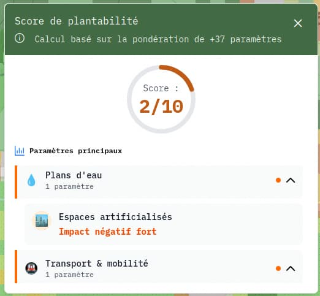

&rarr; Commit [117d402](https://github.com/TelesCoop/iarbre/commit/117d4024c073b861cbc95702502da1d4a2b0d3d5)
&rarr; Commit [a47cafd](https://github.com/TelesCoop/iarbre/commit/a47cafd0d1f2addcb0b4d2584aef4c8bbc4c6a3f)

### ✨ feat : Panel d'explicabilité pour la vulnérabilité à la chaleur

La vulnérabilité à la chaleur est la somme de l'exposition, la sensibilité et la capactié à faire face. Ces facteurs de vulnérabilité sont calculés à partir d'éléments observables sur le terrain qui sont décrits dans ce panel.

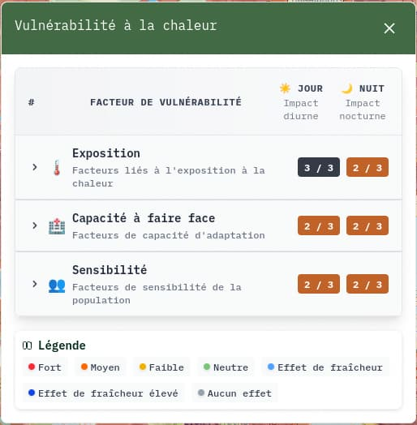

&rarr; Commit [1ee6f5f](https://github.com/TelesCoop/iarbre/commit/1ee6f5f1bb47ef17cb777bbe99bfd3836a132cbd)
&rarr; Commit [49a8242](https://github.com/TelesCoop/iarbre/commit/49a8242b41914d45c90082cd2a7971aba0f4e015)

### ✨ feat : Bouton pour recentrer la carte

Nous avons ajouté un petit bouton permettant de recentrer la carte et le niveau de zoom.

&rarr; Commit [55babeb](https://github.com/TelesCoop/iarbre/commit/55babeb3f8ebd194a1e4b2f2a822b8262816a778)

### 🛠️ enhance : Corrections de bugs mineurs

- Correction des tests e2e
- Ajout de liens plus facilement accessibles sur la iarbre.fr
- Correction DevOps sur les certificats wildcard

## 🔖 0.8.0 (2025-06-04) : Ajout d'images satellite et corrections mineures

### ✨ feat : Images satellite

Il est maintenant possible de superposer les calques à un fond de carte composé d'images satellite. Il s'agit de la basemap open source [World Imagery](https://www.esri.com/arcgis-blog/products/imagery/imagery/learning-more-about-the-world-imagery-basemap) de l'éditeur de logiciels SIG Esri.

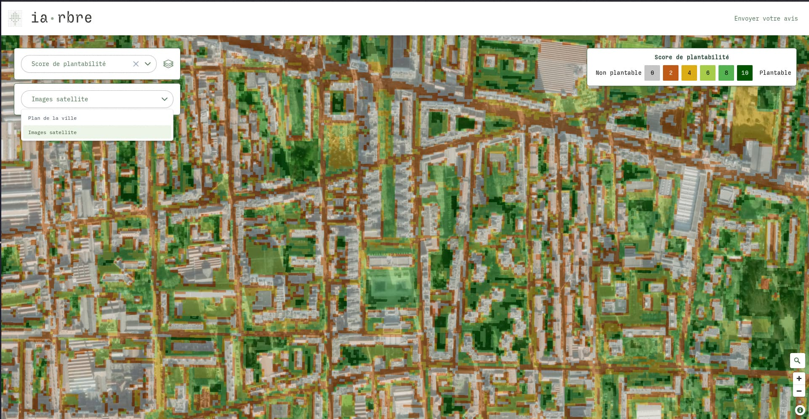

&rarr; Commit [5582a18](https://github.com/TelesCoop/iarbre/commit/5582a182f733ef2e38a70ca721ade7c9cee1c5df)

### 🛠️ enhance : Quelques améliorations et corrections sur le site iarbre.fr

- Ajout de la newsletter dans le header
- Correction de l'affichage dans la section `Articles`
- Affichage correct des images dans la section `Articles`

### 👷 DevOps : Surveillance automatique de la santé

Il y a maintenant une surveillance automatique de l'état de la base de données et de la disponibilité de tous nos environnements.

&rarr; Commit [b02fe04](https://github.com/TelesCoop/iarbre/commit/b02fe04c85a1b88f6b9eff7bcb9db71a9e2aefcc)

## 🔖 0.7.0 (2025-05-19): Geocoder et mise à jour de la page de présentation

### ✨ feat : Geocoder

Ajout d'un geocoder pour pouvoir rechercher une addresse. Le geocoder utilise l'API de [`Nominatim`](https://nominatim.org/), la base d'addresse open-source de `OpenStreetMap`

&rarr;Commit [b9bee09](https://github.com/TelesCoop/iarbre/commit/b9bee09c04bfaecbedd996da846026e191d4b59f)

### 🛠️ enhance : Mise à jour de la page du projet

Mise à jour des logos et ajout de mentions à [`data.grandlyon`](https://data.grandlyon.com/portail/fr/). Mise à jour de l'équipe avec l'ajout des personnes de l'université Lyon 2.

### 📝 doc: Ajout d'une section méthodologie

La section [`Méthodologie`](https://docs.iarbre.fr/methodology/data/) est là pour expliquer d'où proviennent les données que l'on affiche et comment elles ont été obtenues.

&rarr; Commit [515a2f1](https://github.com/TelesCoop/iarbre/commit/515a2f16764754754f2b6b165b865d81e540de3a)

## 🔖 0.6.0 (2025-05-14): Changements cosmétiques

### 🛠️ enhance : rend l'affichage inaccessible sur mobile

L'affichage n'étant pas adapté pour mobile à l'heure actuelle, un message s'affiche maintenant sur mobile pour le signaler et propose un lien vers la page
du projet.

&rarr; Commit [379e073](https://github.com/TelesCoop/iarbre/commit/379e073d296cd379e09dc8685603a459fc4660c2)

### 🛠️ enhance : Homogénisation des légendes

Homogénise les légendes des calques de plantabilité et vulnérabilité à la chaleur. Remplace aussi les hexagones par des carrés pour correspondre aux carrés sur le calque.

&rarr; Commit [2f8b33a](https://github.com/TelesCoop/iarbre/commit/2f8b33a02c9fc741a49c41a6b1d5ddbfd308662d)

### ✨ feat : Retours par email

Les retours sur la carto sont maintenant redirigés par emails en plus d'être sauvegardés en base de données.
&rarr; Commit [d367c5c](https://github.com/TelesCoop/iarbre/commit/d367c5cc19ffafb713d103378c2bb956857f36f9)

## 🔖 0.5.0 (2025-05-07): Refonte visuelle

### 🛠️ enhance : Ajout d'éléments d'explication pour les différents indices en DB

Dans la DB, un champ `details` contient désormais des facteurs explicatifs pour les scores (5 occupations des sols prépondérantes pour la plantabilité, sous-scores pour la vulnérabilité à la chaleur, éléments de décisions pour les LCZ). Ce champ `details` sera par la suite mis en page et affiché au clic sur une tuile.

&rarr; Commit [68480fc](https://github.com/TelesCoop/iarbre/commit/68480fcd2f67e3f998daf129a00ca9cdbd04f909#diff-eaa4f8eeacf6e860936c83d08f36a735da4982a51e65d97b35eff2eefcb6d766)

### ✨ feat : Ajout de la possibilité de visualiser les données diurnes/nocturnes pour le calque de vulnérabilité

Ajout de la visualisation des données diurnes et nocturnes pour le calque de vulnérabilité à la chaleur. Ces
informations sont accessibles dans la pop-up, avec un changement entre les modes disponible via le panel contextuel des
outils.

&rarr; Commit [c3f7977](https://github.com/TelesCoop/iarbre/commit/c3f797754a2a2dc91d4ef77c148b6d75950a691a)

### ✨ feat: Gestion des couleurs de la carte directement dans le front

Auparavant, la couleur des tuiles était codée directement dans les `.mvt` et n'était en particulier par modifiable à la volée. Un changement dans les couleurs nécessitait également de générer à nouveau les tuiles.

&rarr; Ticket [#199](https://github.com/TelesCoop/iarbre/issues/199)

### ✨ feat: Suppression des bordures sur le calque de plantabilité

Pour des raisons esthétiques, on n'affiche plus le quadrillage « inter-tuiles » sur le calque de plantabilité

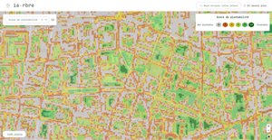

&rarr; Ticket [#207](https://github.com/TelesCoop/iarbre/issues/207)

### ✨ feat: Affichage d'une bordure autour de la zone sélectionnée

La zone sélectionnée est mise en valeur par un léger surlignage noir (à améliorer), ce qui permet de facilement facilement où est-ce qu'on a cliqué.

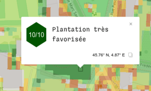

&rarr; Ticket [#213](https://github.com/TelesCoop/iarbre/issues/213)

### ✅ test: Nouveaux tests pour le calque de vulnérabilité et améliorations diverses

- On ne génère plus que les tuiles avec un niveau de zoom 13 dans les tests automatiques, pour gagner du temps

&rarr; Ticket [#186](https://github.com/TelesCoop/iarbre/issues/186)

- Les tests d’intégration sont plus strictes et cassent désormais au moindre warning côté Vue ;
- Génération de données de tests pour le « Calque de vulnérabilité »

&rarr; Ticket [#181](https://github.com/TelesCoop/iarbre/issues/181)

### 🐛 fix: Suppression d'un _clignotement_ au chargement de la page

Suivant la configuration, le calque était chargé puis déchargé puis chargé à nouveau. Cela conduisait à un clignotement côté utilisateur·ice.

&rarr; Ticket [#213](https://github.com/TelesCoop/iarbre/issues/213)

### 🛠️ enhance : ajoute le style de la maquette

Nous utilisons maintenant PrimeVue, une bibliothèque de composants (Ticket [#170](https://github.com/TelesCoop/iarbre/issues/170)) pour appliquer les maquettes concues par notre designer Geoffrey Dorne (https://geoffreydorne.com/).

&rarr; Commit [0f38edf](https://github.com/TelesCoop/iarbre/commit/0f38edfc09fa6dac80492d15ca8a6ad0ac201553)

## 🔖 0.4.0 (2025-04-23): Ajout de contenu sur le site statique et améliorations UX

### ✨ feat: Calcul de la plantabilité en raster

Calcul de la plantabilité à l'aide de raster

1. Convertir les données de Data pour tous les facteurs en raster haute résolution (1x1m)
2. Convolution des rasters, individuellement, avec un noyau carré 5x5. Les pixels des rasters de résultat contiennent le
   pourcentage de chaque facteur sur des tuiles carrés 5x5m.
3. Somme pondérée des rasters d'OCS, avec les poids relatifs aux facteurs, pour produire un raster de plantabilité
4. On crée des geoms qui sont des carrés 5x5m qui vont être insérées dans une DB PostGIS. On utilise les valeurs des
   pixels dans le raster de plantabilité pour remplir le champ correspondant à la plantabilité et à la plantabilité
   seuillée.

En BDD nous n'avons que des géoms qui correspondent au score de plantabilité. Nous n'avons pas de géoms qui
correspondent à l'occupation des sols par chaque facteur.

Les couleurs ont aussi évolué pour une meilleure lisibilité.

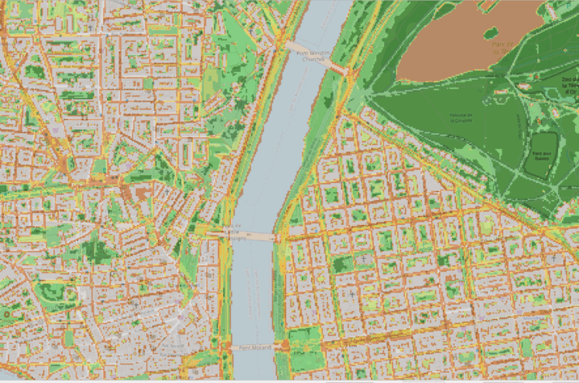

### 🛠️ enhance: Calque de vulnérabilité à la chaleur

Mise à jour de l'échelle de couleurs sur 9 niveaux. La pop-up est aussi mise à jour.

|                                   Avant                                   |                              Après                               |
| :-----------------------------------------------------------------------: | :--------------------------------------------------------------: |
| 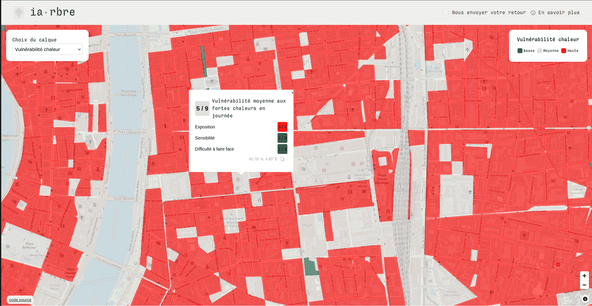 | 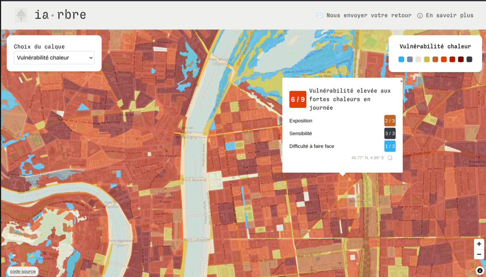 |

&rarr; Commit [ef60f56](https://github.com/TelesCoop/iarbre/commit/ef60f567880e742e32a55106beec5383f5b78863)

### ✨ feat: Intégration de [Sveltia CMS](https://github.com/sveltia/sveltia-cms) pour modifier le site statique

Le contenu du site statique [iarbre.fr](https://iarbre.fr/) peut désormais être modifié sans coder en se connectant avec
ses identifiants Github à l'interface d'administration [iarbre.fr/admin](https://iarbre.fr/admin).

Cette interface permettra à l’avenir de modifier et de publier des articles de blog.

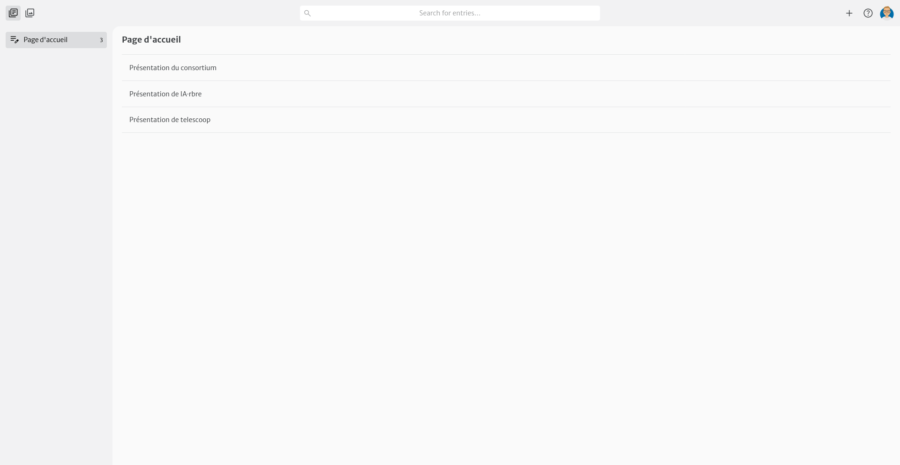

&rarr; Ticket [#43](https://github.com/TelesCoop/iarbre/issues/43)

## 🔖 0.3.0 (2025-09-04) - Mise à jour de données et ajout calque vulnérabilité à la chaleur

### ✨ feat: Possibilité d'ouvrir la carte sur un calque spécifique

Le nom du calque est désormais codé dans l'url, ce qui permet de partager une vue spécifique de la carte, voilà par ex.
l'url centrée sur Lyon centre avec les données de vulnérabilité à la
chaleur : [carte.iarbre.fr/vulnerability/16/45.75773/4.85377](https://carte.iarbre.fr/vulnerability/16/45.75773/4.85377)

&rarr; Ticket [#183](https://github.com/TelesCoop/iarbre/issues/183)

### 🛠️ enhance: Données d'occupation des sols

- Ajout de nouvelles données : place PMR et d'autopartage.
- Mise à jour des données de fibre et de signalisation lumineuse et tricolore.
- Modifications sur certainnes OCS notamment sur les ponts pour lesquelles des tuiles apparaissaient comme plantables

|                             Avant                             |                             Après                             |
| :-----------------------------------------------------------: | :-----------------------------------------------------------: |
| 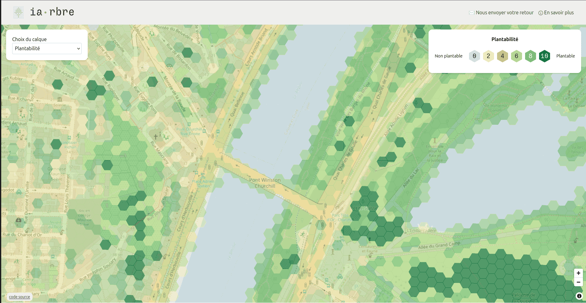 | 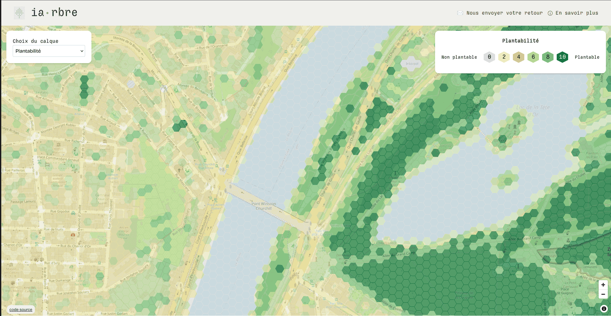 |

&rarr; Ticket [#178](https://github.com/TelesCoop/iarbre/issues/178)

### ✨ feat: Calque vulnérabilité à la chaleur

Nous avons commencé l'intégration
des [travaux](https://geoweb.grandlyon.com/portal/apps/storymaps/collections/7e7862ec92694601a7085074dcaf7481?item=3) de
Maurine Di Tommaso (Direction Environnement, Écologie, Énergie). Le travail est en cours pour la séparation jour/nuit et
une lisibilité accrue des scores.

&rarr; Commit [6c24673](https://github.com/TelesCoop/iarbre/commit/6c24673d4c96230d58d588f56dc54a5d376638ec)

### ✨ feat: Possibilité d'ouvrir la carte à des coordonnées spécifiques

Les coordonnées GPS sont désormais codées dans l'url, ce qui permet de partager une vue spécifique de la carte, voilà
par ex. l'url centrée sur le Lac du
Bourget : [carte.iarbre.fr/11/45.72454/5.88074](https://carte.iarbre.fr/11/45.72454/5.88074)

&rarr; Commit [0103e77](https://github.com/TelesCoop/iarbre/commit/0103e7703c3934f8eeba012fe80b6f64fa2e319f)

### 👷 devops: Génération de données fictives de tests

Nous sommes désormais en mesure de générer en quelques secondes des données pour tester l'application. Cela signifie en
particulier que les tests qui vérifient que la carte est correctement affichée vont désormais être exécutés
automatiquement.

&rarr; Commit [7435604](https://github.com/TelesCoop/iarbre/commit/7435604852342895fbf08791261524c58e45b8f8)

### ⚡️ perf: Amélioration de la performance de la génération des tuiles

La fonction de transformation des géométries entre les système Lambert-93 et Pseudo-Mercator a été accélérée en
supposant que la transformation d'un polygone est équivalente au polygone formé de la projection de chacun de ces
sommets.

&rarr; Commit [7435604](https://github.com/TelesCoop/iarbre/commit/7435604852342895fbf08791261524c58e45b8f8)

### 🧹 chore: Refacto du Tailwind

Nous utilisons Tailwind comme framework CSS sur le projet. Une refacto a été faite afin d'améliorer la maintabilité.

&rarr; Commit [b7ff4cc](https://github.com/TelesCoop/iarbre/commit/b7ff4cc4c4002b0cab206e3f72d319bca2727cc1)

## 🔖 0.2.0 (2025-03-26) - Stabilisations des semaines précédentes

### 🐛 fix: MapPopUp

Il n'existait qu'une PopUp pour le calque de plantabilité, il y en a maintenant une aussi pour les ZCLs. Correction
aussi des bugs de fonctionnement.

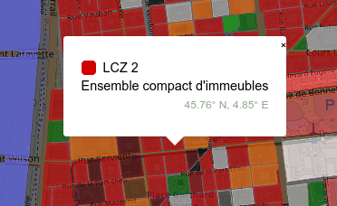

&rarr; Commits [8434d74](https://github.com/TelesCoop/iarbre/commit/8434d74d075c34e27da6d116aafdc152931d927f)
et [b87264a](https://github.com/TelesCoop/iarbre/commit/b87264a624db2e5b6bdb9aac6794dafaf2be69dc)

### ✨ feat: Création du changelog

Création d'un fichier Markdown et un onglet dans le doc pour tenir au courant des changements chaque semaine.

&rarr; Commit [68cc328](https://github.com/TelesCoop/iarbre/commit/68cc3282727f7868ff45f2e2a73241c61ea71728)

### ✨ feat: Bouton feedback

Ajout dans la navbar d'un bouton qui ouvre une fenêtre permettant d'envoyer des feedbacks qui sont enregistrés en base.

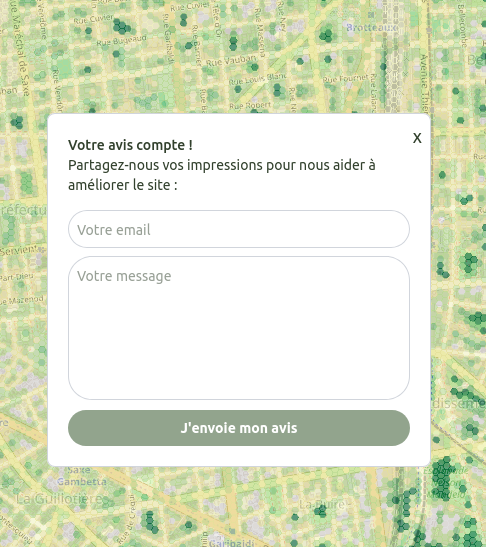

&rarr; Commit [c8dfdc0](https://github.com/TelesCoop/iarbre/commit/c8dfdc0ed35f1615cae58dc20759d525653fbcbe)

### ✨ feat: Légende ZCL + sources des données

Mise à jour de la légende des ZCLs et ajout d'un lien vers la source des données dans le `AttributionControl` de
`MapLibre` : [ERASME](https://datagora.erasme.org/projets/calque-de-plantabilite/) pour le Calque de Plantabilité et
le [CEREMA] (https://www.data.gouv.fr/en/datasets/cartographie-des-zones-climatiques-locales-lcz-de-83-aires-urbaines-de-plus-de-50-000-habitants-2022/)
pour les Zones Climatiques Locales

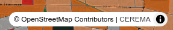

&rarr; Commit [7f45234](https://github.com/TelesCoop/iarbre/commit/7f45234d702382348a10a9cbaed87496445497e0)

### ✨ feat: Standardisation de l'API avec DjangoRestFramework

Les routes d'API étaient définies à la main, maintenant nous utilisant une API REST à l'aide de DjangoRestFramework

&rarr; Ticket [#98](https://github.com/TelesCoop/iarbre/issues/98)

### 👷 devops: CI déploiement automatique des branches de développement

Quand une PR est prête pour review, une instance est deployée par la CI pour visualiser en ligne la nouvelle feature.

&rarr; Commit [fa1e56a](https://github.com/TelesCoop/iarbre/commit/fa1e56aa56141eb19b57174fab599b51f5ca2a7e)

### ✅ test: Meilleurs tests de génération des tuiles sur la grille

On teste maintenant sur des villes fictives (et plus petites) que les tuiles couvrent bien toutes la surface et qu'elles
ne se chevauchent pas. Ca été aussi à l'occasion de revoir la génération de grille pour réduire le nombre de tuiles
inutiles créées.

&rarr; Commit [af7ac23](https://github.com/TelesCoop/iarbre/commit/af7ac23391666c34ebb5127712d217da1c3bd9f8)

## 🔖 0.1.0 (2025-03-12) - Première version

### ✨ feat: Calque de plantabilité

Affiche le calque de plantabilité à la maille 20x20m avec des tuiles hexagonales et des données remises à jour.
La [méthodologie](https://www.data.gouv.fr/fr/datasets/cartographie-des-zones-https://github.com/TelesCoop/iarbre/issues/178
Affiche les Zones Climatique Locales, telle que calculées par
le [CEREMA](https://www.data.gouv.fr/fr/datasets/cartographie-des-zones-climatiques-locales-lcz-de-83-aires-urbaines-de-plus-de-50-000-habitants-2022/).
Le changement entre les calques se fait à l'aide

### ✨ feat: Site vitrine

Le [site](https://iarbre.fr) de présentation du projet est en ligne. Il est généré à partir des fichiers présents dans
le dossier `static`.

### 📝 doc: Création d'une documentation avec MkDocs

La doc est en [ligne](https://docs.iarbre.fr) et est générée à l'aide `MkDocs`.

### ✨ feat: Popup au clic du score de plantabilité

En cliquant sur le calque de plantabilité, un popup apparaît pour afficher le score de la tuile.

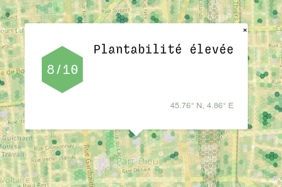

### ✨ feat: CI et deploy

Un CI sur GitHub déploie automatiquement la branche `dev` sur l'instance de [`preprod`](https://preprod-carte.iarbre.fr)
et la branche `main` surl'instance de [`prod`](https://carte.iarbre.fr), après avoir fait tourner l'intégralité des
tests (front et back).
Il existe aussi une instance [`feature`](https://feature-carte.iarbre.fr) pour tester une feature en ligne.

&rarr; Commit [f78b230
](https://github.com/TelesCoop/iarbre/commit/f78b230d08168eddf18c6d2fa52ab133b58eea9d)

> Le suivi des changements a été créé en février 2025 mais le projet a commencé en novembre 2024 !
