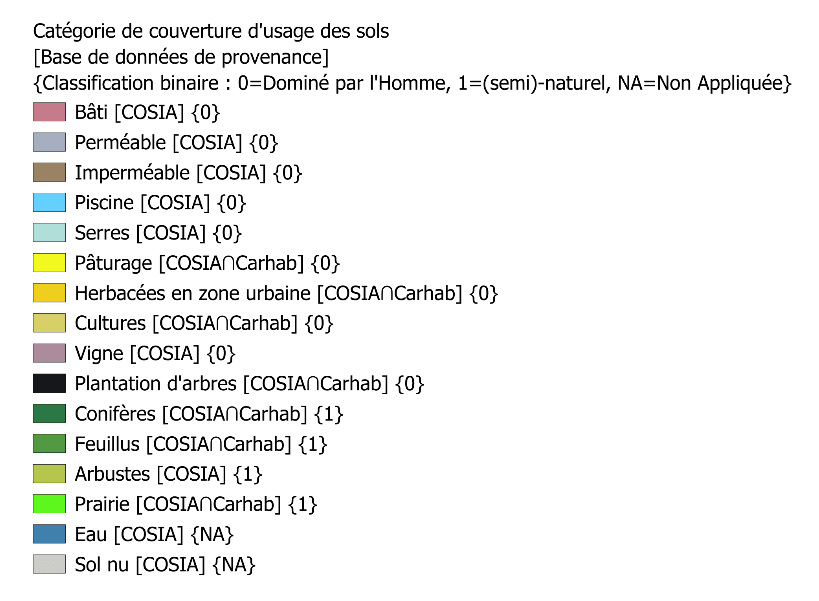

# Indice Fonctionnel de la Biodiversité

_2025 Emile Balembois — Licence CC BY-NC-SA 4.0_

## Origine des données

Les données sont issues d’une collaboration entre l’Ecoles des Mines de Saint-Etienne (Laboratoire Génie de l’environnement pour les organisations au sein d’Environnement Villes et Sociétés) et le service Climat et Résilience de la Métropole de Lyon. Cette collaboration a notamment consisté à la réalisation du stage de Duli Rashid au sein du service Climat et Résilience et à la publication [d’un rapport](https://millenaire3.grandlyon.com/ressources/2025/l-integrite-de-la-biosphere-un-regard-complementaire-sur-la-biodiversite-applique-a-l-echelle-de-la-metropole-de-lyon). L’analyse et les données ont été conçues et produites par Emile Balembois (Ecole des Mines de Saint-Etienne – Environnement Villes et Sociétés) sous la supervision d’Antoine Giret (Ecole des Mines de Saint-Etienne – Environnement Villes et Sociétés).

Ces données ont été produites suite à un calcul à partir de 2 bases de données de couverture des sols en open source fournie pour la métropole de Lyon : [Cosia](https://geoservices.ign.fr/cosia) (donnée 2023 produite par l’IGN) et [CarHab](https://geoservices.ign.fr/habitats-carhab) (donnée produite par l’IGN et l’université Jean Monnet).

Les téléchargements des données et calculs ont été réalisés en décembre 2025.

## Méthode

### Principe de l’indicateur

Cet indicateur est [hérité d’études scientifiques sur le cadre des limites planétaires](https://www.nature.com/articles/s41586-023-06083-8) qui définissent une proportion minimale d’espaces naturels nécessaires dans les espaces modifiés par l’Homme – tels que la métropole de Lyon - pour maintenir une biodiversité fonctionnelle. L’enjeu est de maintenir les fonctions écologiques suivantes :

* Pollinisation
* Impact positif sur la santé des habitants
* Régulation des maladies et ravageurs
* Maintien de la qualité de l’eau douce
* Préservation de l’érosion des sols

Une étude scientifique ([Mohamed et al., 2024](https://www.cell.com/one-earth/fulltext/S2590-3322(23)00564-X?_returnURL=https%3A%2F%2Flinkinghub.elsevier.com%2Fretrieve%2Fpii%2FS259033222300564X%3Fshowall%3Dtrue)) a ainsi proposé cet indicateur appuyé sur une revue de plus de 4000 publications en écologie et en santé. Elle montre qu’un minimum entre **20 et 25% d’espaces (semi)-naturels dans le km² environnant** est nécessaire en tout point d’un territoire pour maintenir les fonctions écologiques ci-dessus.

### Méthode générale

La méthode de calcul de l’indicateur d’intégrité fonctionnelle de la biosphère proposé par cette étude s’articule en 2 étapes en s’appuyant sur des cartographies de couverture des sols :

* Classer les catégories de couverture des sols de façon binaire selon leur correspondance ou non à un espace (semi)-naturel (classé en 1) ou dominé par l’Homme (classé en 0).
* Calculer, en tout point modifié par l’homme, la proportion d’espaces semi-naturels dans le **km² environnant**.

### Sélection des données d’usage des sols

Pour réaliser classification, une recherche de bases de données adéquates a été réalisée pour répondre à 2 contraintes. La première est une contrainte de résolution : il est nécessaire de pouvoir différencier des éléments ponctuels telles que des haies ou des arbres (classées en 1) au sein de catégories différentes (telles que des cultures ou des pelouses, classées en 0). Pour produire ce calque, la base de données Cosia a été sélectionnée[^1]. La seconde est une contrainte de classification, il est nécessaire de différencier différents usages au sein d’une même catégorie de couverture des sols dans Cosia qui n’auront pas la même classification. Par exemple, parmi les couverts arborés, différencier les plantations d’arbres (classé en 0) des forêt (classé en 1). Ici, une intersection a été réalisée entre les catégories de couverture des sols de Cosia à différencier et une autre base de données, CarHab[^2].

La nomenclature utilisée pour l’analyse ainsi que sa classification binaire est donnée dans la Figure ci-dessous. Le calcul n’est pas appliqué pour certaines zones (comme les cours d’eaux) pour lesquels cette analyse de densité d’espaces naturels n’a pas été conçue.

[^1]: Cette base a en effet pour vocation de différencier en particulier les couverts arborés avec une haute résolution. Voir la [documentation de la base de données](https://geoservices.ign.fr/sites/default/files/2025-01/Cosia_Documentation_Technique_IGN_2023.pdf).
[^2]: [CarHab](https://geoservices.ign.fr/actualites/2025-03-carhab) permet en effet de différentier les usages des sols à travers une analyse de la qualité des habitats

### Calcul et représentation de l’indicateur

L’indicateur est ensuite calculé à partir de la cartographie de couverture des sols sur une grille de résolution 4m. Le principe est de calculer en tout point de cette grille la proportion d’espace semi-naturels (classés en 1) dans un rayon de 500m autour de ce point. Une version du code utilisé pour réaliser ce calcul est disponible sur [le dossier GitHub suivant](https://github.com/douxlit/Biosphere-Functional-Integrity/blob/main/Functional_Integrity.py).

L’indicateur est ensuite représenté suivant une légende permettant d’identifier les espaces respectant ou non la cible de 20 à 25% minimum d’espaces (semi)-naturels dans le km2 environnant.