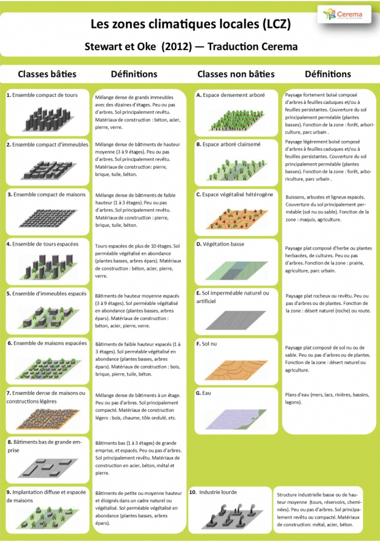
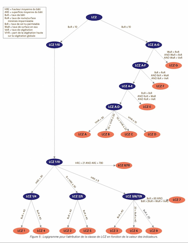

# Les zones climatiques locales

## Origine des données

Les données proviennent d’un travail du [CEREMA](https://www.cerema.fr/fr/actualites/cerema-publie-nouvelles-donnees-surchauffe-urbaine) et sont disponibles sur [data.gouv.fr](https://www.data.gouv.fr/fr/datasets/cartographie-des-zones-climatiques-locales-lcz-de-83-aires-urbaines-de-plus-de-50-000-habitants-2022/).
Les données actuellement affichées sur la [carte](https://carte.iarbre.fr/lcz) sont à jour de _juillet 2022_.

Les zones climatiques locales sont un premier aperçu des conditions climatiques locales, basé sur la morphologie du bâti et des rues, l’occupation des sols et des indicateurs thermo-physiques. L’objectif est de repérer les quartiers les plus concernés pour ensuite pouvoir y mener des études d’îlots de chaleur urbains et décider des actions à mener en priorité.

> ⚠️ **Attention** ⚠️ Les zones climatiques locales ne sont **PAS** une étude d’îlot de chaleur urbain (ICU).

La procédure de classification des zones climatiques locales a été proposée à l’origine par Stewart et Oke en 2012 et se divise en 17 catégories.

Le CEREMA a retravaillé ces catégories et les critères de classification afférents au fil de plusieurs années de recherche et de R&D (DiaCliMAP, SatLCZ) pour aboutir à leur méthodologie de calcul.

## Données d’entrée

Les données utilisées sont de deux types et proviennent de trois sources.

### Données satellites

1. Le CEREMA a utilisé des données brutes d’imagerie spatiale SPOT 2022 pour calculer l’occupation des sols, notamment pour la végétation.
2. La segmentation morphologique de la ville se fait à partir des données _Urban Atlas_, du projet européen Copernicus, elles-mêmes construites à partir d’images satellites.

### Données IGN

1. La BD TOPO est utilisée pour obtenir le bâti 3D, les hauteurs des bâtiments notamment, ainsi que l’occupation des sols (routes, voies ferrées, surfaces en eau, etc.).
2. En parallèle, un modèle numérique de surface couplé à la RGE Alti 1 m permet de connaître la hauteur de la végétation.
   Les données IGN utilisées sont produites à partir d’orthophotos et de relevés LIDAR.

## Arbre de décision

C’est ensuite un logigramme qui permet de classer chaque zone de _l’Urban Atlas_ en fonction du bâti 3D et de l’occupation des sols.

